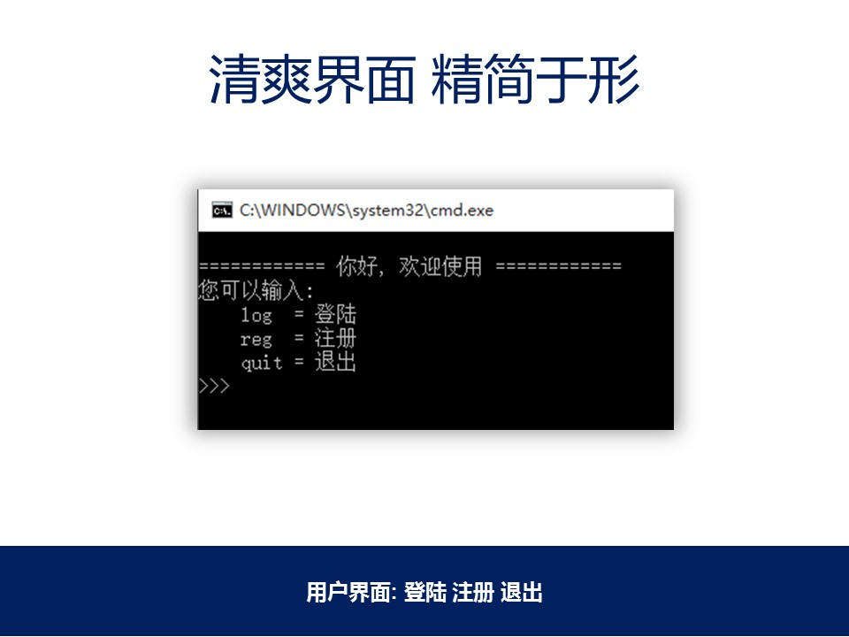
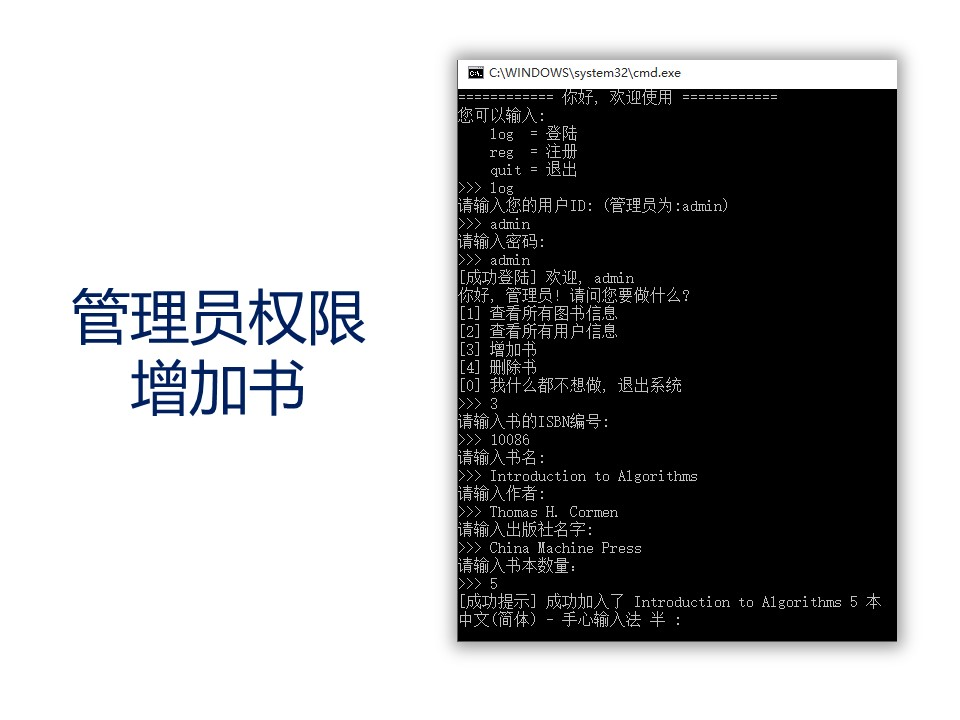
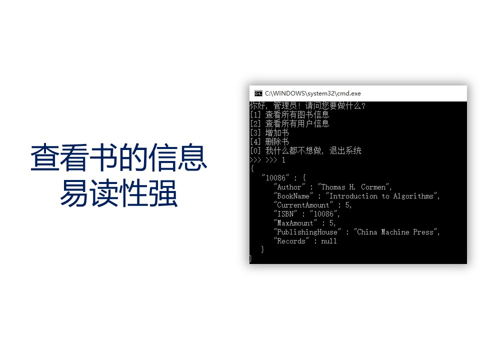
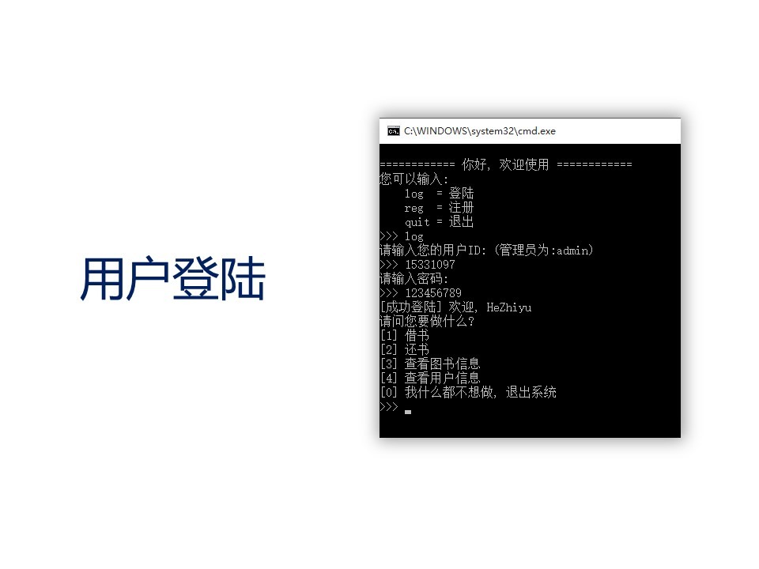
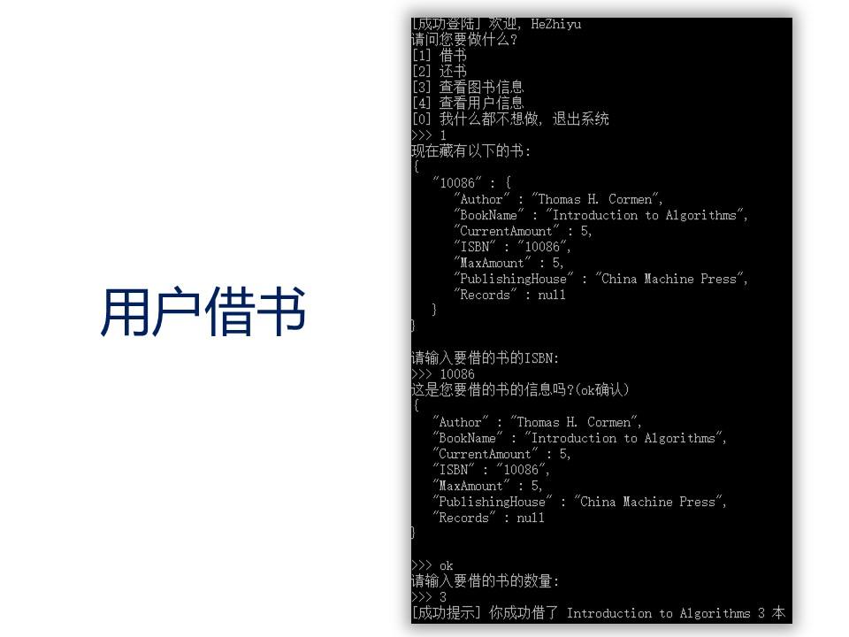
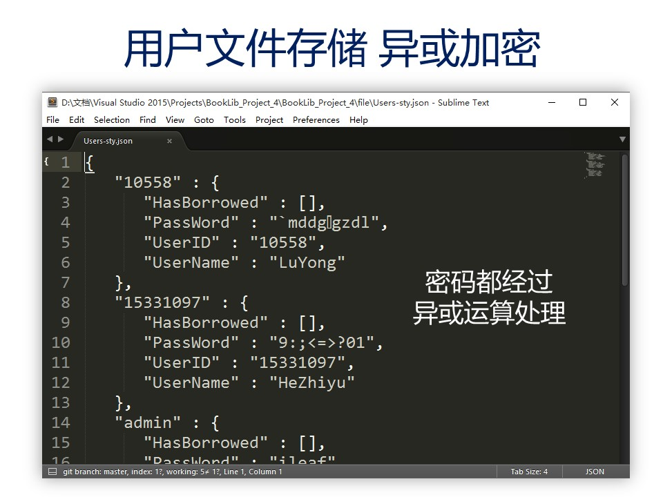
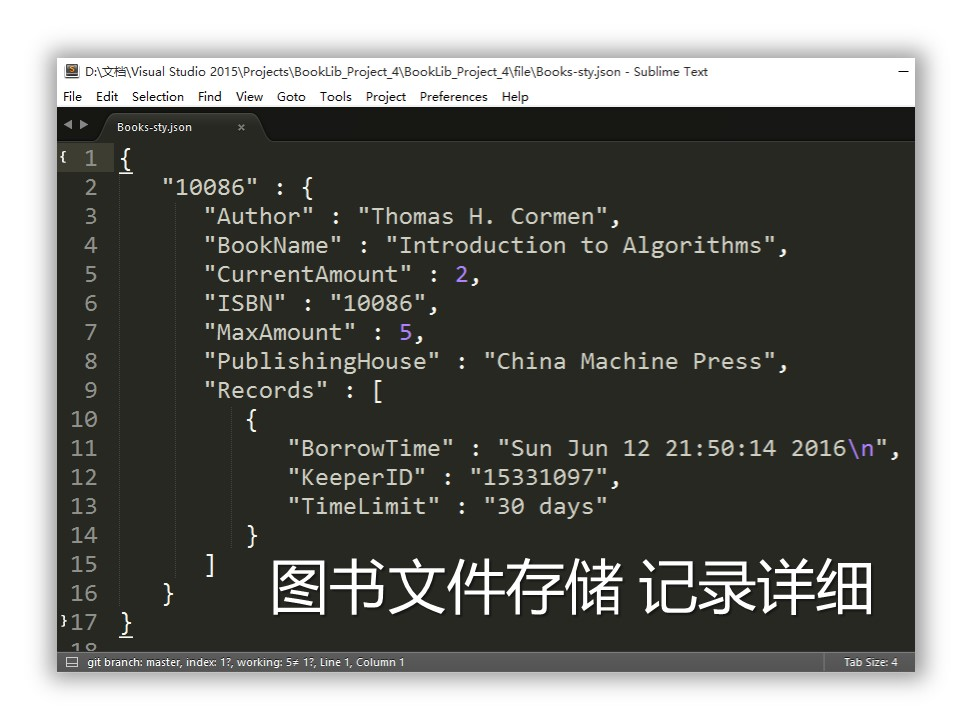
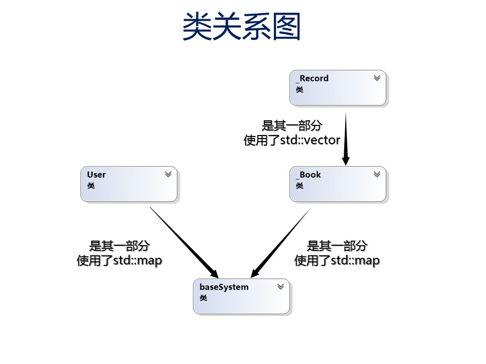
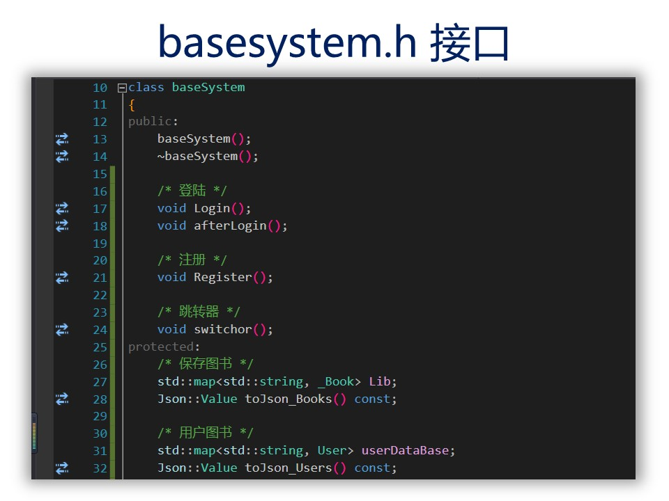
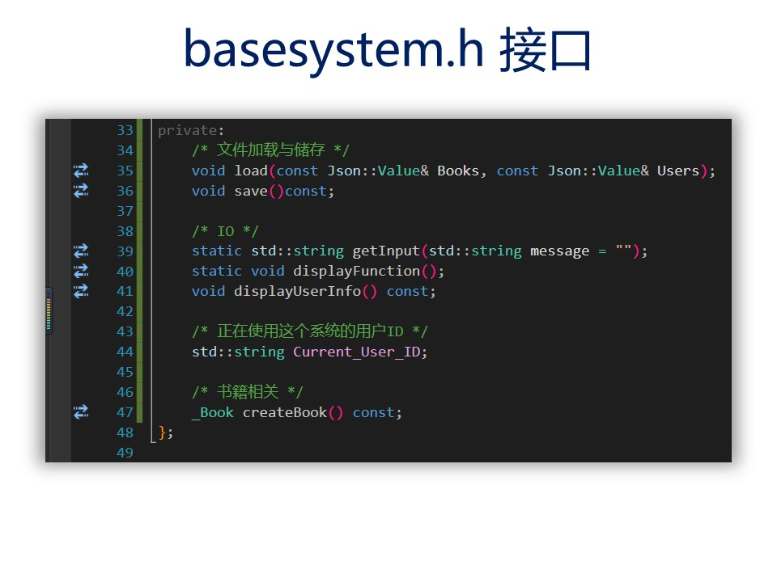

# 程序设计实验报告
- 姓名: 何志宇
- 学号: 15331097
- 班级: 软工3班

## 需求分析
有完备体系的图书管理系统, 满足图书馆借书查阅等日常需求

## 实现思路
将图书管理系统的功能分解, 整个图书馆可以看作一个大的对象, 管理员可以视为一种"特殊的"用户, 即拥有特权的用户.

## 实验成果
原本备用展示的PPT =  =(万一展示了..)...

## 难点&解决办法&心得体会
功能分解麻烦, 不过还好可以看清楚.
更加深入理解了OOP对象思想. 功能函数设计有了一定的提升